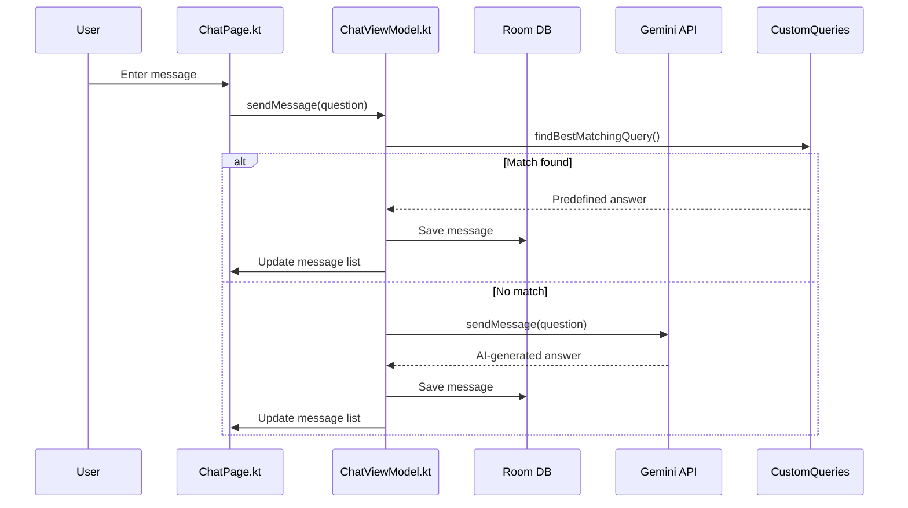

# GCET Connect - College Assistant Chatbot


GCET Connect is an intelligent chatbot application designed specifically for Galgotias College of Engineering and Technology (GCET) students. It provides instant access to college-related information, helping students navigate academic resources, campus facilities, and administrative procedures.

## Features

- **AI-Powered Responses**: Utilizes Google's Gemini AI model for natural language understanding and contextual responses
- **College-Specific Knowledge**: Pre-programmed with GCET-specific information about departments, facilities, schedules, and procedures
- **Persistent Chat History**: Saves conversation history using Room database
- **Modern UI**: Built with Jetpack Compose featuring animations, adaptive layouts, and material design principles
- **Suggestion Chips**: Quick access to common queries through interactive suggestion chips
- **Dual Response System**: Uses both pre-defined answers for common queries and AI-generated responses for unique questions

## Screenshots

[Screenshots will be added here]

## Technical Architecture

### Key Components

- **UI Layer**: Jetpack Compose-based interface with animations
- **ViewModel Layer**: Manages application state and business logic
- **Data Layer**: Room database for message persistence
- **AI Integration**: Google Generative AI (Gemini) for intelligent responses

### Libraries Used

- **Jetpack Compose**: Modern Android UI toolkit
- **Room**: Database persistence
- **Lottie**: Animation library for enhanced UI elements
- **Google Generative AI**: AI service integration
- **Kotlin Coroutines**: Asynchronous programming
- **Lifecycle Components**: For managing UI-related data

## Implementation Details

### Main Components

1. **ChatViewModel.kt**: Core component that manages the chat logic, message persistence, query processing, and AI integration
2. **ChatPage.kt**: UI implementation of the chat interface with animations and interactions
3. **CustomQueries.kt**: Repository of pre-defined college-specific answers
4. **MainActivity.kt**: Navigation control and application entry point
5. **SplashScreen.kt**: Animated introduction screen

### Response System

The app uses a dual approach for answering questions:

1. **Pattern Matching**: For common college-specific queries, the app uses a similarity-based algorithm to match questions with pre-defined answers
2. **AI Generation**: When no match is found, the query is sent to the Gemini AI model with specific context and rules

## Data Flow & Control Flow

### Data Flow
1. **User Input**: User sends a message via the chat UI (ChatPage.kt).
2. **ViewModel Processing**: ChatViewModel receives the message, checks for a matching pre-defined query, or forwards it to the Gemini AI model.
3. **AI/Custom Response**: The response is either fetched from custom queries or generated by Gemini.
4. **Persistence**: All messages are saved and loaded from the Room database.
5. **UI Update**: The UI observes the message list and updates in real time.

### Control Flow
- The ViewModel manages all business logic, including similarity matching, AI calls, and message persistence.
- Asynchronous operations are handled using Kotlin Coroutines.
- The UI layer is reactive, observing state changes from the ViewModel.

## Tech Stack & Frameworks
- **Language**: Kotlin
- **UI**: Jetpack Compose
- **Database**: Room
- **AI**: Google Gemini Generative AI
- **Async**: Kotlin Coroutines
- **Animation**: Lottie
- **Architecture**: MVVM (Model-View-ViewModel)

## Structure Diagram
```mermaid
graph TD
    UI[ChatPage.kt (UI)] --> VM[ChatViewModel.kt (ViewModel)]
    VM --> DB[Room Database]
    VM --> AI[Google Gemini API]
    VM --> CQ[CustomQueries.kt]
    DB <--> VM
    AI <--> VM
    CQ <--> VM
```

## Data Flow Diagram


## Setup Instructions

### Prerequisites

- Android Studio Arctic Fox or newer
- Minimum SDK: 24 (Android 7.0)
- Target SDK: 34 (Android 14)
- Google AI API key for Gemini

### Getting Started

1. Clone the repository
2. Open the project in Android Studio
3. Add your Gemini API key in `Constants.kt`
4. Sync Gradle and run the application

## Configuration

The application can be customized by:

1. Modifying pre-defined answers in `CustomQueries.kt`
2. Adjusting AI context and rules in `ChatViewModel.kt`
3. Customizing UI elements in `ChatPage.kt`

## Contributing

Contributions to improve GCET Connect are welcome. Please follow these steps:

1. Fork the repository
2. Create a feature branch (`git checkout -b feature/amazing-feature`)
3. Commit your changes (`git commit -m 'Add some amazing feature'`)
4. Push to the branch (`git push origin feature/amazing-feature`)
5. Open a Pull Request

## License
This project is licensed under the MIT License - see below for details:

MIT License

Copyright (c) 2024

## Acknowledgements

- Galgotias College of Engineering and Technology for inspiration
- Google for the Generative AI API
- Android Jetpack team for Compose

## API Key Setup

This application uses the Gemini API. To run the app, you need to set up your own API key:

1. Create a copy of `gradle.properties.example` and name it `gradle.properties`
2. Replace `your_gemini_api_key_here` with your actual Gemini API key
3. Build and run the application

## Note for Collaborators

The `gradle.properties` file is excluded from Git to keep API keys secure. Never commit this file to version control.
