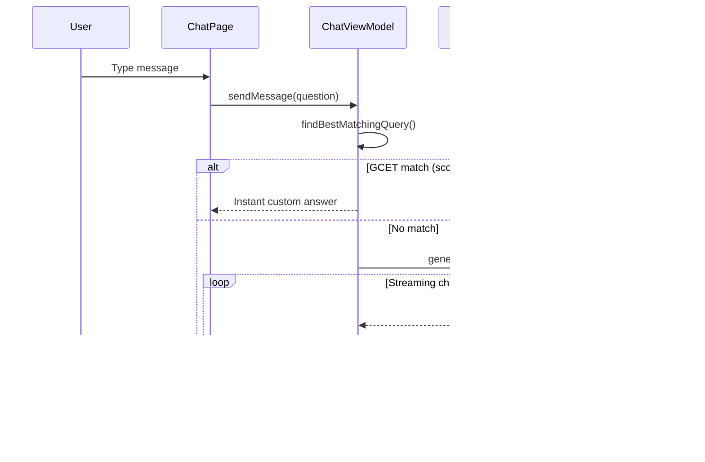
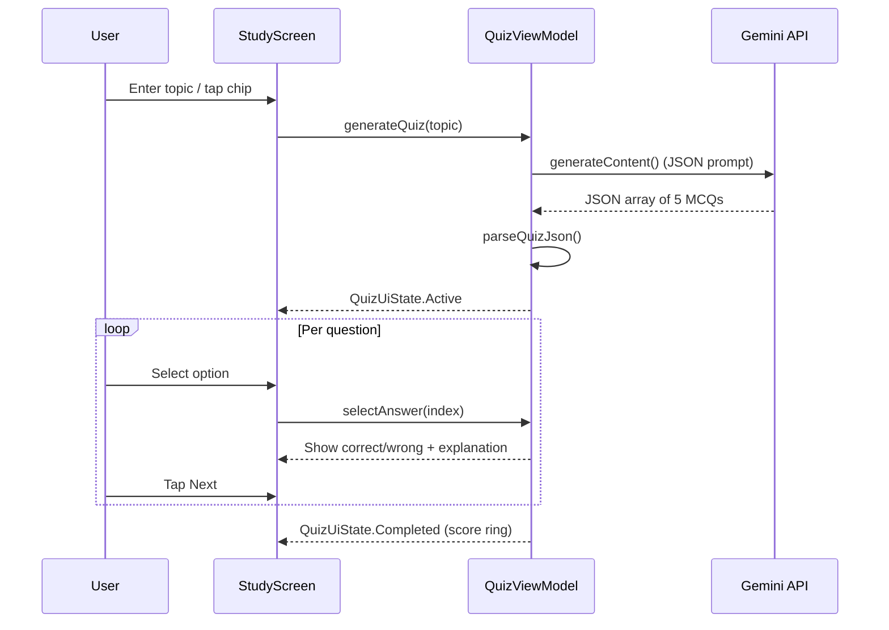

# GCET Connect — College Assistant Chatbot


GCET Connect is an AI-powered assistant for Galgotias College of Engineering and Technology students. It combines a streaming Gemini chatbot with a Study MCQ Generator — an interactive quiz engine that generates subject-specific multiple-choice questions on demand.

---

## Features

| Feature | Details |
|---|---|
| **Streaming AI Chat** | Real-time token-by-token responses via Gemini 2.5 Flash |
| **Study MCQ Generator** | Generates 5 MCQs on any CS/engineering topic using structured Gemini output |
| **Interactive Quiz** | Option selection, correct/wrong highlighting, per-question explanations |
| **Score Ring** | Animated circular score display at quiz completion |
| **Persistent Chat History** | Room database stores full conversation across sessions |
| **Dual Response System** | Similarity-matched custom answers for GCET-specific queries; Gemini for the rest |
| **Modern UI** | Teal + Charcoal palette, Inter font, Material 3, light + dark mode |
| **Hilt Dependency Injection** | All ViewModels, repositories, and SDK clients wired via Hilt |

---

## Screenshots

*Coming soon*

---

## Architecture

Clean Architecture with MVVM pattern across three layers:

```
presentation/
  ui/          → Compose screens (ChatPage, StudyScreen, SplashScreen)
  viewmodel/   → ChatViewModel, QuizViewModel (HiltViewModel)
domain/
  model/       → MessageModel, QuizQuestion
  repository/  → ChatRepository interface
data/
  local/       → Room DB (MessageEntity, ChatDao, AppDatabase)
  repository/  → ChatRepositoryImpl
di/            → AppModule (Hilt — provides GenerativeModel, Client, DB)
utils/         → customQueries (GCET-specific Q&A map)
```

### Data Flow — Chat


```mermaid
sequenceDiagram
    participant User
    participant ChatPage
    participant ChatViewModel
    participant Room DB
    participant Gemini API

    User->>ChatPage: Type message
    ChatPage->>ChatViewModel: sendMessage(question)
    ChatViewModel->>ChatViewModel: findBestMatchingQuery()
    alt GCET match (score > 0.7)
        ChatViewModel-->>ChatPage: Instant custom answer
    else No match
        ChatViewModel->>Gemini API: generateContentStream()
        loop Streaming chunks
            Gemini API-->>ChatViewModel: chunk.text()
            ChatViewModel-->>ChatPage: Accumulate + update UI
        end
    end
    ChatViewModel->>Room DB: persistMessage()
```

### Data Flow — Study Quiz


```mermaid
sequenceDiagram
    participant User
    participant StudyScreen
    participant QuizViewModel
    participant Gemini API

    User->>StudyScreen: Enter topic / tap chip
    StudyScreen->>QuizViewModel: generateQuiz(topic)
    QuizViewModel->>Gemini API: generateContent() (JSON prompt)
    Gemini API-->>QuizViewModel: JSON array of 5 MCQs
    QuizViewModel->>QuizViewModel: parseQuizJson()
    QuizViewModel-->>StudyScreen: QuizUiState.Active
    loop Per question
        User->>StudyScreen: Select option
        StudyScreen->>QuizViewModel: selectAnswer(index)
        QuizViewModel-->>StudyScreen: Show correct/wrong + explanation
        User->>StudyScreen: Tap Next
    end
    QuizViewModel-->>StudyScreen: QuizUiState.Completed (score ring)
```

---

## Tech Stack

| Layer | Technology |
|---|---|
| Language | Kotlin |
| UI | Jetpack Compose + Material 3 |
| Navigation | Navigation Compose |
| Architecture | MVVM + Clean Architecture |
| DI | Hilt (Dagger) + KSP |
| Database | Room |
| AI — Chat | Google GenAI SDK (`com.google.genai:google-genai`) |
| AI — Quiz | Google GenAI SDK (structured JSON output) |
| Async | Kotlin Coroutines + StateFlow |
| Animation | Lottie, AnimatedContent, animateFloatAsState |
| Fonts | Google Fonts (Inter) via `ui-text-google-fonts` |

---

## Project Structure

```
app/src/main/java/app/recruit/collegebot/
├── data/
│   ├── local/
│   │   ├── AppDatabase.kt
│   │   ├── ChatDao.kt
│   │   └── entities/MessageEntity.kt
│   └── repository/ChatRepositoryImpl.kt
├── di/
│   └── AppModule.kt
├── domain/
│   ├── model/
│   │   ├── MessageModel.kt
│   │   └── QuizQuestion.kt
│   └── repository/ChatRepository.kt
├── presentation/
│   ├── ui/
│   │   ├── chat/ChatPage.kt
│   │   ├── main/MainActivity.kt
│   │   ├── splash/SplashScreen.kt
│   │   ├── study/StudyScreen.kt
│   │   └── theme/
│   │       ├── Color.kt
│   │       ├── Theme.kt
│   │       └── Type.kt
│   └── viewmodel/
│       ├── ChatUiState.kt
│       ├── ChatViewModel.kt
│       ├── QuizUiState.kt
│       └── QuizViewModel.kt
├── utils/
│   └── CustomQueries.kt
└── GCETApplication.kt
```

---

## Setup

### Prerequisites

- Android Studio Hedgehog or newer
- Android SDK 24+ (Java 11)
- Google AI Studio API key — get one at [aistudio.google.com](https://aistudio.google.com)

> **Note on API keys (June 2026+):** Google AI Studio now issues *auth keys* (`AQ.xxx` format). These require the unified GenAI SDK (`com.google.genai:google-genai`) — the old `com.google.ai.client.generativeai` SDK does **not** support them.

### Getting Started

1. Clone the repository
2. Open in Android Studio and let Gradle sync
3. Add your Gemini API key to `local.properties` (never commit this file):
   ```
   GEMINI_API_KEY=AQ.your_key_here
   ```
4. Do **Build → Clean Project**, then **Build → Rebuild Project** (key is baked in at compile time)
5. Run on device or emulator (min API 24)

### API Key Security

- `local.properties` is gitignored — key never hits version control
- Key injected via `buildConfigField` in `build.gradle.kts`, accessible as `BuildConfig.GEMINI_API_KEY`
- Alternative: set `GEMINI_API_KEY` as an environment variable before building

---

## Key Implementation Notes

### Streaming Chat
`ChatViewModel.sendMessage()` calls `client.models.generateContentStream()` and accumulates chunks directly into the last message in `_uiState`, producing a live typewriter effect.

### Quiz JSON Parsing
`QuizViewModel.generateQuiz()` uses `generateContent()` (not streaming) to get a complete JSON response. The prompt enforces strict JSON — no markdown, no extra text. The parser strips any accidental code fences before passing to `org.json.JSONObject`.

### QuizUiState Machine
`Idle → Loading → Active → Completed` (or `Error` at any step). `AnimatedContent` drives phase transitions in `StudyScreen`.

### Hilt Graph
`AppModule` provides:
- `Client` (GenAI SDK, auth-key aware)
- `GenerativeModel` (legacy, retained for QuizViewModel compatibility)
- `AppDatabase` + `ChatDao`
- `ChatRepository`

---

## Contributing

1. Fork the repo
2. Create a feature branch: `git checkout -b feature/your-feature`
3. Commit with a clear message
4. Open a Pull Request

---

## License

MIT License — Copyright (c) 2024

---

## Acknowledgements

- Galgotias College of Engineering and Technology
- Google DeepMind — Gemini API
- Android Jetpack team — Compose
